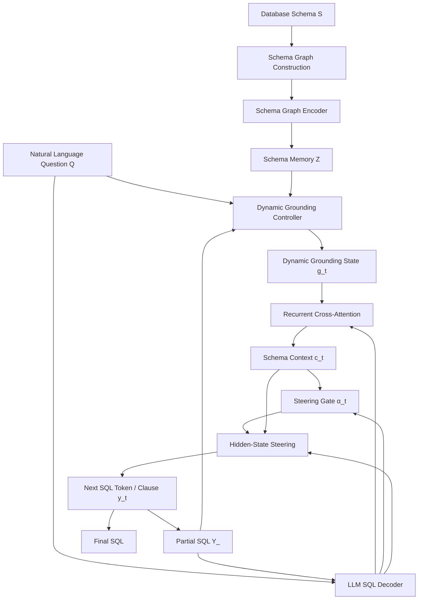
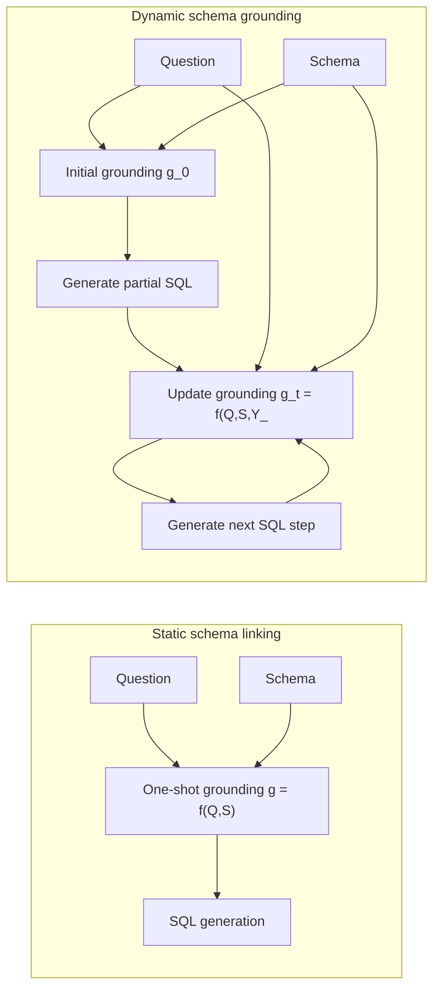
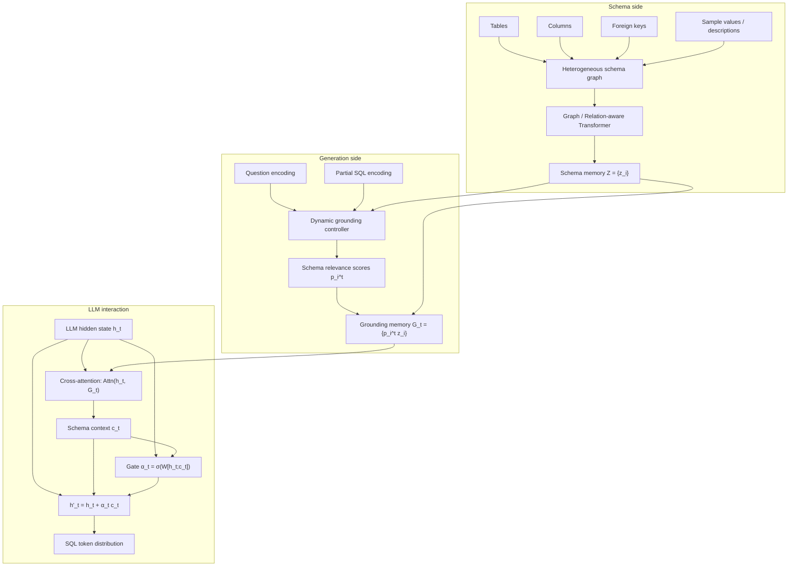
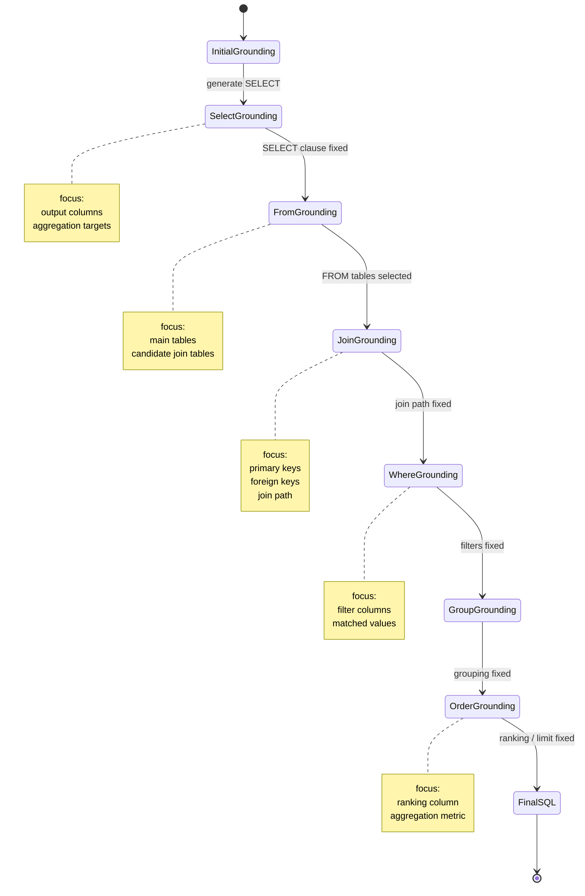
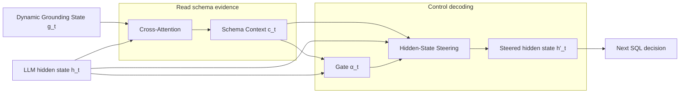
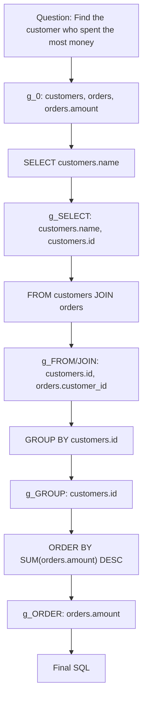
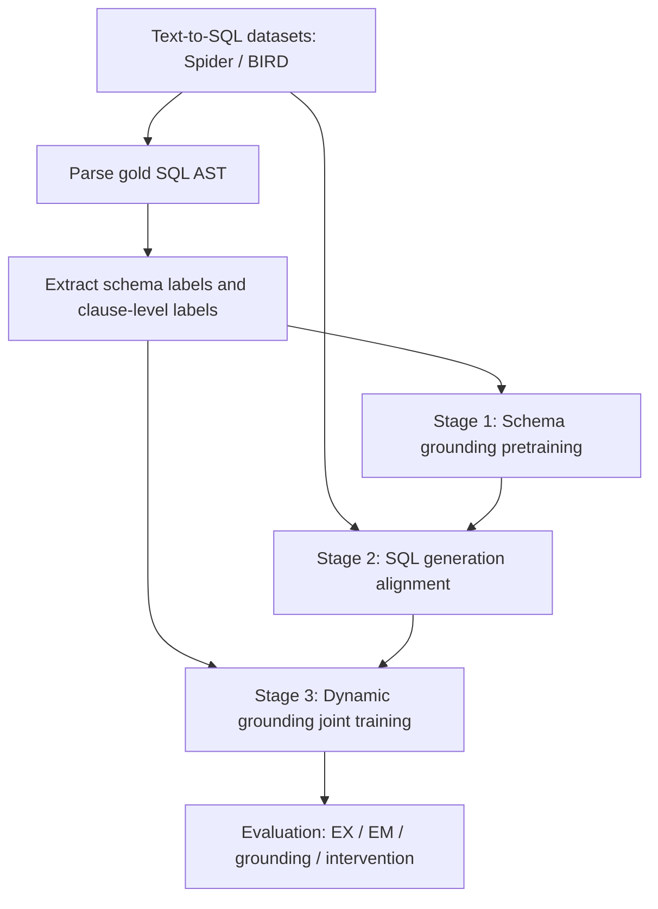

# 08. Model Architecture Diagrams

本文件整理 Dynamic Schema Grounding 方法的图示版本。所有图均使用 Mermaid，可直接放入 Markdown、论文草稿或开题材料中继续修改。

## Figure 1：Overall Framework

这张图用于论文方法总览。核心表达是：

> schema grounding 不是一次性检索结果，而是在 SQL 生成过程中被 partial SQL 反复更新的动态状态。



## Figure 2：Static Schema Linking vs Dynamic Schema Grounding

这张图适合放在 Introduction 或 Motivation，突出本文与传统 schema linking 的区别。



## Figure 3：Detailed Module View

这张图用于 Method 部分，展示每个模块的输入输出。



## Figure 4：Clause-level Grounding Update

如果论文采用 clause-level update，这张图很关键。它能说明为什么动态 grounding 符合 SQL 结构。



## Figure 5：Cross-Attention and Steering as Two Roles of One Grounding State

这张图用于解释“二合一为什么合理”：cross-attention 负责读取，steering 负责调控。



## Figure 6：Example Grounding Trajectory

示例问题：

```text
Find the customer who spent the most money.
```

对应 SQL：

```sql
SELECT customers.name
FROM customers
JOIN orders ON customers.id = orders.customer_id
GROUP BY customers.id
ORDER BY SUM(orders.amount) DESC
LIMIT 1
```



## Figure 7：Training Pipeline



## 论文插图建议

建议最终论文保留 3 张主图：

1. **Figure 1 Overall Framework**：放在 Introduction 或 Method 开头。
2. **Figure 2 Static vs Dynamic**：放在 Motivation。
3. **Figure 4 Clause-level Grounding Update** 或 **Figure 6 Grounding Trajectory**：放在实验分析或方法解释。

如果篇幅有限，Figure 3 可以作为 supplementary。

